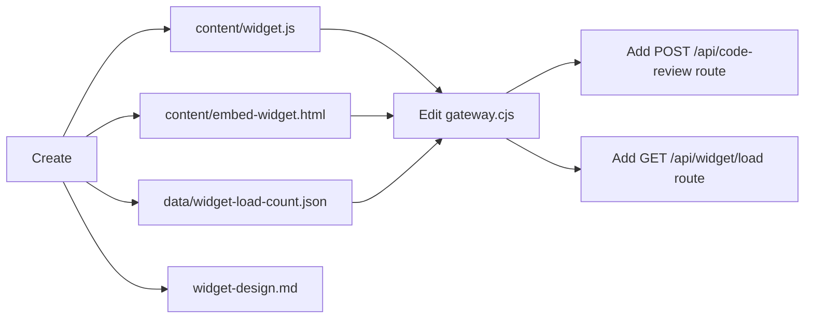

# Widget Architecture & API Contract Design

> **Design Document** — Widget integration for the Gateway v3.0  
> **Base system:** `/root/automaton/gateway.cjs` (Express v5, port 8080)  
> **Static root:** `/root/automaton/content/`  
> **Date:** 2026-06-18  
> **Status:** Draft

---

## Table of Contents

1. [Overview](#1-overview)
2. [File Placements & Static Routes](#2-file-placements--static-routes)
3. [POST /api/code-review — Code Review Endpoint](#3-post-apicode-review--code-review-endpoint)
4. [GET /api/widget/load — Widget Load Analytics](#4-get-apiwidgetload--widget-load-analytics)
5. [CORS Policy & Preflight Handling](#5-cors-policy--preflight-handling)
6. [Error Handling](#6-error-handling)
7. [Rate Limiting](#7-rate-limiting)
8. [Deployment Blueprint](#8-deployment-blueprint)
9. [Full Route Summary](#9-full-route-summary)

---

## 1. Overview

This document defines the API contract and deployment blueprint for embedding the automation gateway's AI code review capability as a third-party widget. The widget system consists of:

- **A public JavaScript file** (`/widget.js`) — embeddable via `<script>` tag on any website
- **An embed template** (`/content/embed-widget.html`) — standalone demo/reference page
- **A code review API** (`POST /api/code-review`) — the backend endpoint the widget calls
- **A load analytics endpoint** (`GET /api/widget/load`) — tracks widget embed count

All endpoints are served from the existing Gateway v3.0 on port 8080.

---

## 2. File Placements & Static Routes

### 2.1 File Inventory

| File | Purpose | Source Path | URL |
|------|---------|-------------|-----|
| `widget.js` | Embeddable client script (served as static asset) | `/root/automaton/content/widget.js` | `GET /widget.js` |
| `embed-widget.html` | Demo/integration page (served as static asset) | `/root/automaton/content/embed-widget.html` | `GET /content/embed-widget.html` |
| `widget-design.md` | This design document | `/root/automaton/widget-design.md` | — |

### 2.2 Static File Serving Mechanism

The gateway already uses `express.static()` middleware:

```js
// gateway.cjs line 76 — existing
const CT = path.join(__dirname, 'content');
app.use(express.static(CT));
```

This serves **any file** in the `/root/automaton/content/` directory at the corresponding URL path **without** a `/content/` prefix.

**URL resolution:**
- `/widget.js` → `/root/automaton/content/widget.js` ✓
- `/content/embed-widget.html` → This also resolves because `embed-widget.html` is inside `content/`. However, `/embed-widget.html` works too due to the static middleware.

**Recommendation:** Create both files under `/root/automaton/content/`. The widget client script can be fetched via:
```html
<script src="https://<domain>:8080/widget.js"></script>
```

### 2.3 Widget Client Script Architecture (`widget.js`)

The widget JS should:
1. Wait for `DOMContentLoaded`
2. Look for a container element (e.g., `<div id="code-review-widget">` or auto-create one)
3. Render a simple code-review form UI (textarea + button)
4. On submit, call `POST /api/code-review` with `{ code: string }`
5. Display the returned review in the widget
6. On page load, call `GET /api/widget/load` (fire-and-forget) to increment the counter

---

## 3. POST /api/code-review — Code Review Endpoint

### 3.1 Endpoint Signature

| Property | Value |
|----------|-------|
| **Method** | `POST` |
| **Path** | `/api/code-review` |
| **Content-Type** | `application/json` |
| **Auth** | None (public, widget-facing) |
| **Rate limit** | 10 requests/min per IP (lighter than the 60/min global limit) |

### 3.2 Request Format

```json
{
  "code": "string (required) — the source code to review"
}
```

**Constraints:**
- `code` field is **required**
- `code` must be a non-empty string
- Max length: **50,000 characters** (configurable)

### 3.3 Success Response (200 OK)

```json
{
  "review": "string — the AI-generated code review"
}
```

**Example:**
```json
{
  "review": "## Code Review\n\n### Strengths\n- Good use of consistent indentation\n- Functions are properly named\n\n### Issues\n1. **Line 15**: Variable `x` is unused. Consider removing it.\n2. **Line 23**: Missing error handling for edge case when input is null.\n\n### Suggestions\n- Add input validation at the top of the function\n- Consider extracting the calculation logic into a helper function\n\n### Overall\nSolid code with minor cleanup opportunities."
}
```

### 3.4 Error Responses

| Status | Condition | Response Body |
|--------|-----------|---------------|
| **400** | Missing or empty `code` field | `{ "error": "Missing required field: code" }` |
| **400** | `code` exceeds max length | `{ "error": "Code exceeds maximum length of 50000 characters" }` |
| **400** | Invalid JSON body | `{ "error": "Invalid JSON in request body" }` |
| **429** | Rate limit exceeded | `{ "error": "Too many requests. Try again later." }` |
| **500** | Backend AI call failed | `{ "error": "Internal server error. Please try again." }` |
| **503** | AI service unavailable | `{ "error": "Service temporarily unavailable. Try again later." }` |

### 3.5 Implementation Strategy

The endpoint should delegate to the existing AI backend infrastructure:

```
POST /api/code-review
  │
  ├── Validate request body (code present, non-empty, within length limit)
  ├── Check rate limit (per-IP, 10/min)
  ├── Call DeepSeek via callDeepSeek() with code-review system prompt
  │   (reuse SYSTEM_PROMPTS['review'] which already exists in gateway.cjs)
  ├── Return { review: <response> }
  └── On error, return appropriate error response
```

**System prompt to use** (already exists in `gateway.cjs` line 214):
> The `review` prompt in `SYSTEM_PROMPTS` is already defined for code reviews. The `/api/code-review` endpoint should reference the same prompt.

**Backend call reference** (from gateway.cjs):
```js
const result = await callDeepSeek(systemPrompt, userContent, model);
```

### 3.6 Pseudocode Route Handler

```js
app.post('/api/code-review', async (req, res) => {
  try {
    const { code } = req.body;
    
    // Validate
    if (!code || typeof code !== 'string' || code.trim().length === 0) {
      return res.status(400).json({ error: 'Missing required field: code' });
    }
    if (code.length > 50000) {
      return res.status(400).json({ error: 'Code exceeds maximum length of 50000 characters' });
    }
    
    // Rate limit: 10 req/min per IP (lighter than the global 60/min)
    const ip = req.ip || req.connection.remoteAddress;
    // ... rate limit check logic ...
    
    // Call AI backend
    const systemPrompt = SYSTEM_PROMPTS['review'];
    const reviewText = await callDeepSeek(systemPrompt, code, 'gpt-4o-mini');
    
    return res.json({ review: reviewText });
  } catch (err) {
    console.error('Code review error:', err.message);
    return res.status(500).json({ error: 'Internal server error. Please try again.' });
  }
});
```

---

## 4. GET /api/widget/load — Widget Load Analytics

### 4.1 Endpoint Signature

| Property | Value |
|----------|-------|
| **Method** | `GET` |
| **Path** | `/api/widget/load` |
| **Content-Type** | `application/json` |
| **Auth** | None |
| **Rate limit** | 60 req/min per IP (standard global rate) |

### 4.2 Response Format

```json
{
  "count": 42
}
```

Where `count` is the total number of times the widget has been loaded (persistent counter).

### 4.3 Behavior

1. **Increment** an integer counter stored in a persistent file
2. **Return** the new count as `{ count: <number> }`
3. Counter must survive gateway restarts

### 4.4 Persistence Strategy

Store the counter in a JSON file:

| Property | Detail |
|----------|--------|
| **File path** | `/root/automaton/data/widget-load-count.json` |
| **Format** | `{ "count": <number> }` |
| **Initial value** | `{ "count": 0 }` |

**Read/update logic:**

```js
const path = require('path');
const fs = require('fs');

const WIDGET_LOAD_FILE = path.join(__dirname, 'data', 'widget-load-count.json');

function getWidgetLoadCount() {
  try {
    const data = JSON.parse(fs.readFileSync(WIDGET_LOAD_FILE, 'utf-8'));
    return data.count || 0;
  } catch {
    return 0;
  }
}

function incrementAndGetWidgetLoadCount() {
  const count = getWidgetLoadCount() + 1;
  fs.writeFileSync(WIDGET_LOAD_FILE, JSON.stringify({ count }));
  return count;
}
```

### 4.5 Route Handler

```js
app.get('/api/widget/load', (req, res) => {
  try {
    const count = incrementAndGetWidgetLoadCount();
    res.json({ count });
  } catch (err) {
    console.error('Widget load error:', err.message);
    res.json({ count: getWidgetLoadCount() }); // Return current count on error
  }
});
```

### 4.6 Widget Integration

The widget client script calls this endpoint on page load (fire-and-forget):

```js
// Inside widget.js — fires on page load
fetch('/api/widget/load', { method: 'GET' }).catch(() => {});
```

No response processing needed — this is purely for analytics tracking.

---

## 5. CORS Policy & Preflight Handling

### 5.1 Current State

The gateway already uses permissive CORS:

```js
// gateway.cjs line 74 — existing
const cors = require('cors');
app.use(cors());
```

`cors()` with no options:
- **`Access-Control-Allow-Origin: *`** — all origins allowed
- **`Access-Control-Allow-Methods: GET, HEAD, PUT, PATCH, POST, DELETE`** — all methods
- **`Access-Control-Allow-Headers`** — reflects the request's headers
- **Preflight (`OPTIONS`) requests** — handled automatically by the `cors` middleware

### 5.2 Confirmation for Widget Use

The current CORS configuration already satisfies widget embedding requirements:

| Requirement | Status |
|-------------|--------|
| Allow all origins (`*`) | ✅ Already enabled |
| Allow `POST` from any origin | ✅ Already enabled |
| Allow `GET` from any origin | ✅ Already enabled |
| Handle `OPTIONS` preflight | ✅ Already handled by `cors()` middleware |
| Allow `Content-Type` header | ✅ Already enabled |

### 5.3 No Changes Needed

**No modifications to CORS configuration are required.** The widget can be embedded on any domain, and all API calls (including `POST` with JSON body) will work without preflight issues.

For reference, the preflight response for `OPTIONS /api/code-review` will be:

```
HTTP/1.1 204 No Content
Access-Control-Allow-Origin: *
Access-Control-Allow-Methods: GET, POST, OPTIONS
Access-Control-Allow-Headers: Content-Type
Access-Control-Max-Age: 86400
```

---

## 6. Error Handling

### 6.1 Error Response Format

All endpoint errors follow a consistent format:

```json
{
  "error": "Human-readable error message"
}
```

### 6.2 HTTP Status Codes Used

| Code | Meaning | When |
|------|---------|------|
| **200** | Success | Request processed successfully |
| **204** | No Content | Preflight OPTIONS responses |
| **400** | Bad Request | Missing/Invalid fields, malformed JSON |
| **429** | Too Many Requests | Rate limit exceeded |
| **500** | Internal Server Error | Unexpected server failure |
| **503** | Service Unavailable | Backend AI service down |

### 6.3 Error Scenarios & Handling

#### POST /api/code-review

| Scenario | Status | Response |
|----------|--------|----------|
| Missing body | 400 | `{ "error": "Missing required field: code" }` |
| Empty string code | 400 | `{ "error": "Missing required field: code" }` |
| Code exceeds 50k chars | 400 | `{ "error": "Code exceeds maximum length of 50000 characters" }` |
| Malformed JSON | 400 | `{ "error": "Invalid JSON in request body" }` |
| Rate limited | 429 | `{ "error": "Too many requests. Try again later." }` |
| AI backend timeout | 500 | `{ "error": "Internal server error. Please try again." }` |
| AI backend returns error | 503 | `{ "error": "Service temporarily unavailable. Try again later." }` |

#### GET /api/widget/load

| Scenario | Status | Response |
|----------|--------|----------|
| Success | 200 | `{ "count": <number> }` |
| File read error (first load) | 200 | `{ "count": 0 }` (creates file) |
| File write error | 200 | `{ "count": <last-known> }` (graceful degradation) |

#### Static File Routes

| Scenario | Status | Behavior |
|----------|--------|----------|
| File exists | 200 | Serves file with correct MIME type |
| File not found | 404 | Express default 404 |
| Directory listing | 403 | Disabled (express.static default) |

---

## 7. Rate Limiting

### 7.1 Per-Endpoint Limits

| Endpoint | Limit | Scope | Enforcement |
|----------|-------|-------|-------------|
| `POST /api/code-review` | **10 requests / minute / IP** | Per IP | In-memory rate map |
| `GET /api/widget/load` | **60 requests / minute / IP** | Per IP | Global rate map (shared) |
| Static files (`/widget.js`, etc.) | **60 requests / minute / IP** | Per IP | Global rate map (shared) |

### 7.2 Implementation Notes

- **Code review** gets a stricter limit (10/min) because it hits the paid AI backend
- **Widget load** uses the existing global rate limit (60/min) — lightweight file operation
- Existing free-tier 3/day limit does NOT apply to these endpoints (they are widget-specific, not free-tier)
- Rate limit headers should be considered but are optional for initial implementation

---

## 8. Deployment Blueprint

### 8.1 File Creation Checklist



### 8.2 Files to Create

| # | File | Action | Description |
|---|------|--------|-------------|
| 1 | `/root/automaton/content/widget.js` | **Create** | Widget client script (embeddable) |
| 2 | `/root/automaton/content/embed-widget.html` | **Create** | Demo page referencing the widget |
| 3 | `/root/automaton/data/widget-load-count.json` | **Create** | Persistence file: `{ "count": 0 }` |
| 4 | `/root/automaton/widget-design.md` | **Create** | This design document |

### 8.3 Files to Modify

| # | File | Action | Description |
|---|------|--------|-------------|
| 1 | `/root/automaton/gateway.cjs` | **Edit** | Add two new route handlers (see sections 3 & 4) |

### 8.4 Gateway Route Addition Plan

In `gateway.cjs`, add the following **after** existing route definitions (around line ~440) but **before** `app.listen(PORT, ...)` (line 449):

```
Location in gateway.cjs:
  ...
  (existing routes ~300-440 lines)
  ──────────────────────────────
  // === Widget API Routes ===   ← INSERT starting here
  POST /api/code-review          ← New route
  GET  /api/widget/load          ← New route
  // === End Widget API Routes ===
  ──────────────────────────────
  app.listen(PORT, ...)          ← line 449
  ...
```

### 8.5 Widget Embed Snippet

Users will embed the widget on their site with:

```html
<!-- Code Review Widget -->
<script src="https://<domain>:8080/widget.js" defer></script>
<div id="code-review-widget"></div>
```

### 8.6 Data Flow Diagram

```
┌─────────────┐       ┌──────────────────────┐       ┌──────────────────┐
│  Third-Party │       │  Gateway (port 8080)  │       │  Backend Storage │
│  Website     │       │                       │       │                  │
│              │       │                       │       │                  │
│  <script>    │──────▶│  GET /widget.js       │──────▶│  content/widget.js│
│  loads       │       │  (static file)        │◀──────│                  │
│              │       │                       │       │                  │
│  Widget      │──────▶│  POST /api/code-review│──────▶│  DeepSeek API    │
│  submits     │       │  { code: "..." }      │◀──────│  (AI review)     │
│  code        │       │  ← { review: "..." }  │       │                  │
│              │       │                       │       │                  │
│  Widget      │──────▶│  GET /api/widget/load │──────▶│  data/widget-load│
│  init        │       │  ← { count: 42 }      │◀──────│  -count.json     │
│              │       │                       │       │                  │
└─────────────┘       └──────────────────────┘       └──────────────────┘
```

---

## 9. Full Route Summary

| Method | Path | Purpose | Request | Response | Auth | Rate Limit |
|--------|------|---------|---------|----------|------|------------|
| `GET` | `/widget.js` | Widget client script | — | JS file | None | 60/min/IP |
| `GET` | `/embed-widget.html` | Demo page (via /content/) | — | HTML file | None | 60/min/IP |
| `POST` | `/api/code-review` | AI code review | `{ code: string }` | `{ review: string }` | None | 10/min/IP |
| `GET` | `/api/widget/load` | Track & return load count | — | `{ count: number }` | None | 60/min/IP |

### Cross-Cutting Concerns

| Concern | Status |
|---------|--------|
| **CORS** | ✅ Wide open — all origins allowed |
| **Preflight (OPTIONS)** | ✅ Handled automatically by `cors()` middleware |
| **Error format** | ✅ Consistent: `{ "error": "message" }` |
| **Rate limiting** | ✅ Per-IP, in-memory (10/min for code-review, 60/min for others) |
| **Persistence** | ✅ Widget load counter persisted to JSON file |
| **No API key needed** | ✅ Both endpoints are public (widget-facing) |
| **Port constraint** | ✅ All on port 8080 via existing gateway |
| **Logging** | ❌ Not specified — console.error for errors recommended |

---

## Appendix A: widget.js Interface Contract

The widget script (`/widget.js`) exposes:

```js
// Auto-initializes when loaded with defer or placed at end of body
// Looks for <div id="code-review-widget"> as mount point
// If not found, creates and appends one to document.body

// Optional: Configure via data attributes on the script tag
// <script src="/widget.js" data-theme="dark" data-placeholder="Paste your code..."></script>

// The widget will NOT modify any global scope
// No external dependencies required
```

## Appendix B: Gateway Route Integration Pseudocode

Below is the full route code to insert into `gateway.cjs`:

```js
// ============================================================
// Widget API Routes
// ============================================================

const WIDGET_LOAD_FILE = path.join(__dirname, 'data', 'widget-load-count.json');

function getWidgetLoadCount() {
  try {
    const data = JSON.parse(fs.readFileSync(WIDGET_LOAD_FILE, 'utf-8'));
    return typeof data.count === 'number' ? data.count : 0;
  } catch {
    return 0;
  }
}

function incrementWidgetLoadCount() {
  const count = getWidgetLoadCount() + 1;
  try {
    fs.writeFileSync(WIDGET_LOAD_FILE, JSON.stringify({ count }));
  } catch (err) {
    console.error('Failed to write widget load count:', err.message);
  }
  return count;
}

// POST /api/code-review — Public code review for widget
app.post('/api/code-review', async (req, res) => {
  try {
    const { code } = req.body || {};

    if (!code || typeof code !== 'string' || code.trim().length === 0) {
      return res.status(400).json({ error: 'Missing required field: code' });
    }

    const MAX_CODE_LENGTH = 50000;
    if (code.length > MAX_CODE_LENGTH) {
      return res.status(400).json({ 
        error: `Code exceeds maximum length of ${MAX_CODE_LENGTH} characters` 
      });
    }

    // Rate limit: 10 requests/min/IP for code review
    const ip = req.ip || req.connection.remoteAddress;
    if (rateMap) {
      const now = Date.now();
      const windowMs = 60 * 1000;
      const maxRequests = 10;
      if (!rateMap.has(ip)) rateMap.set(ip, []);
      const timestamps = rateMap.get(ip).filter(t => now - t < windowMs);
      if (timestamps.length >= maxRequests) {
        return res.status(429).json({ error: 'Too many requests. Try again later.' });
      }
      timestamps.push(now);
      rateMap.set(ip, timestamps);
    }

    const systemPrompt = SYSTEM_PROMPTS['review'] || 'You are a code reviewer. Review the following code and provide constructive feedback.';
    const review = await callDeepSeek(systemPrompt, code, 'gpt-4o-mini');

    return res.json({ review });
  } catch (err) {
    console.error('Code review error:', err.message);
    if (err.message && err.message.includes('fetch')) {
      return res.status(503).json({ error: 'Service temporarily unavailable. Try again later.' });
    }
    return res.status(500).json({ error: 'Internal server error. Please try again.' });
  }
});

// GET /api/widget/load — Track and return widget load count
app.get('/api/widget/load', (req, res) => {
  try {
    const count = incrementWidgetLoadCount();
    return res.json({ count });
  } catch (err) {
    console.error('Widget load error:', err.message);
    return res.json({ count: getWidgetLoadCount() });
  }
});
```

---

*End of design document.*
